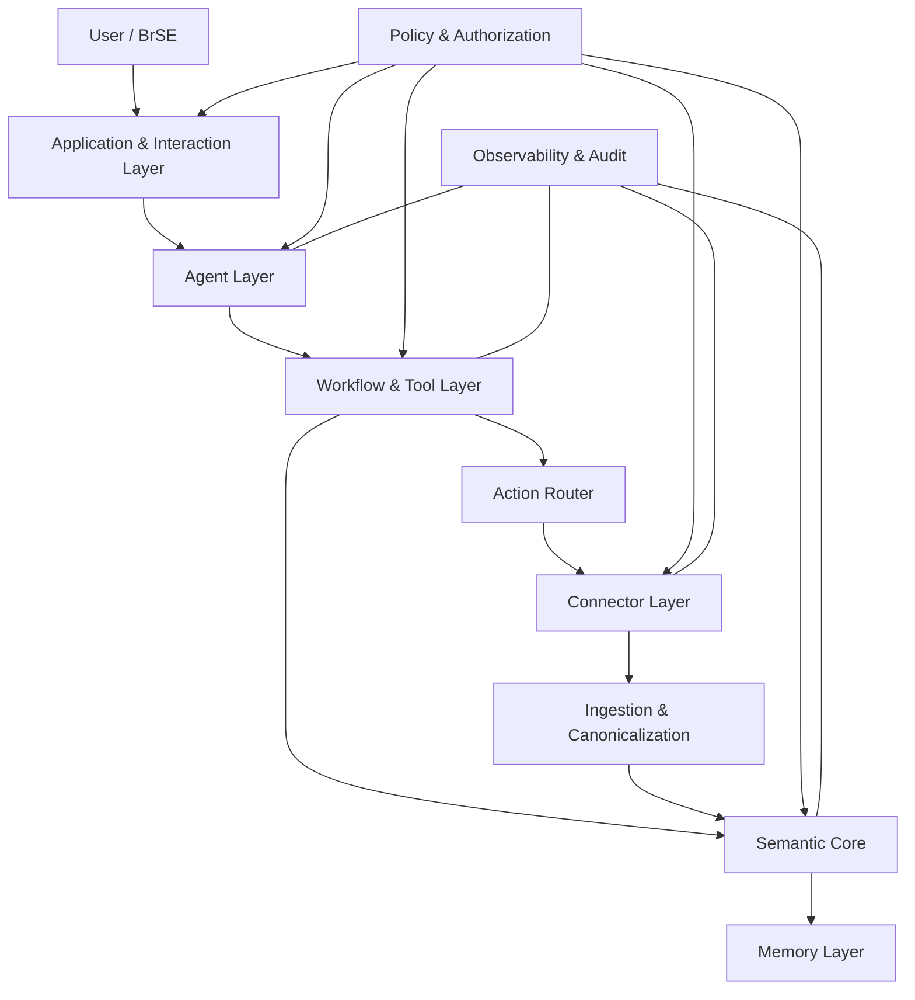
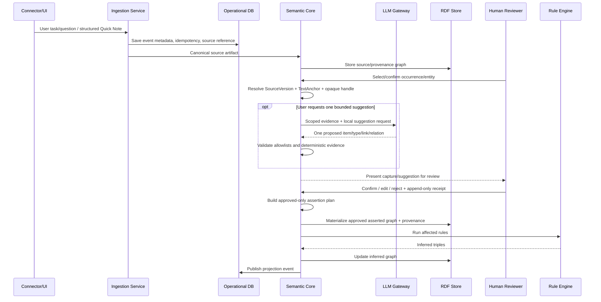
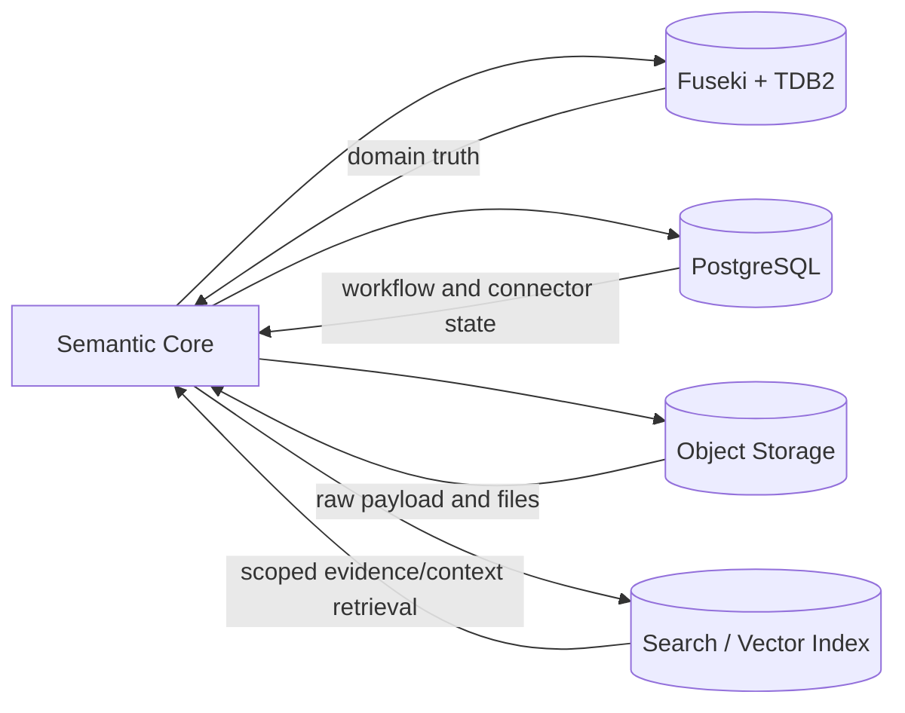
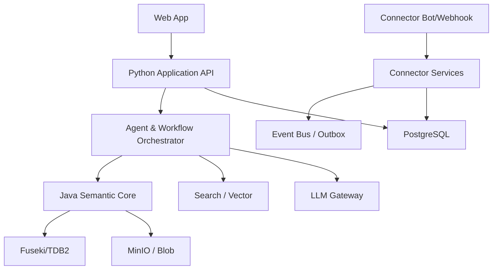

# Project Architecture Overview

## 1. Mục tiêu kiến trúc

Kiến trúc phải đảm bảo:

- Channel-independent.
- Ontology-driven.
- Evidence-grounded.
- Replaceable LLM.
- Human-governed.
- Multi-project và multi-tenant.
- Có thể mở rộng connector.
- Có thể giải thích và audit.
- Không phụ thuộc transcript.

---

## 2. Layered Architecture



---

## 3. Các lớp chính

## 3.1. Application and Interaction Layer

Giao diện người dùng:

- Web application.
- Teams/Slack bot surface.
- Quick Note form.
- Candidate review UI.
- Project dashboard.
- Search and question interface.
- Approval UI.
- Connector settings.

Giao diện không truy cập trực tiếp RDF hoặc connector API. Mọi hành động đi qua application service và policy.

---

## 3.2. Agent Layer

Chức năng:

- Intent interpretation.
- Tool selection.
- Bounded local suggestion on demand.
- Occurrence/entity linking after human selection.
- Research planning.
- Natural-language synthesis.
- Draft generation.

Agent không:

- Tự cập nhật asserted graph.
- Tự quyết định quyền.
- Tự thực hiện external action không qua policy.
- Tự định nghĩa ontology production.

Model được truy cập qua `LLM Gateway` để tránh vendor lock-in.

---

## 3.3. Workflow and Tool Layer

Bao gồm các workflow xác định:

- Capture note.
- Select/confirm source occurrence and entity.
- Propose one bounded item/type/link/relation (optional).
- Confirm/edit/reject suggestion with receipt.
- Prepare meeting brief.
- Research topic.
- Generate project update.
- Review blockers.
- Send approved communication.
- Synchronize connector.
- Rebuild projections.

Tool contract phải typed và deterministic.

Ví dụ:

```text
get_project_context(project_id, user_id)
retrieve_scoped_evidence(project_id, question)
capture_entity_occurrence(source_version_id, anchor, reviewer_id)
suggest_one_item(confirmed_occurrence_handle, request_context)
validate_candidate(candidate_graph_id)
record_review_receipt(candidate_id, decision, reviewer_id)
materialize_approved_assertion(approved_plan_id)
prepare_meeting_brief(project_id, meeting_id)
send_approved_message(action_id)
```

AI suggestion là optional, local và on-demand. Không có tool nào được phép
gọi provider nền, tự cấp global ID/offset, auto-approve hoặc ghi asserted graph.

---

## 3.4. Semantic Core

Đây là lõi của hệ thống:

- Ontology loading.
- RDF mapping.
- Named graph routing.
- SHACL validation.
- Candidate lifecycle.
- Asserted knowledge update.
- Inference execution.
- Provenance recording.
- Semantic query service.
- Ontology version compatibility.
- Entity identity and relation validation.

Semantic Core nên là service riêng, ưu tiên Java/Kotlin với Apache Jena.

---

## 3.5. Memory Layer

Memory Layer gồm nhiều loại memory, không đồng nhất với vector database:

- Semantic Domain Memory.
- Source/Evidence Memory.
- Retrieval Memory.
- Operational Memory.
- Working/Session Memory.
- Derived Read Models.

Chi tiết nằm trong tài liệu `04-Memory-Layer.md`.

---

## 3.6. Connector Layer

Mỗi connector triển khai cùng contract:

```text
Inbound:
- receive events
- pull changes
- fetch resource
- resolve external identity

Outbound:
- send message
- reply
- create external task
- upload artifact

Operational:
- authenticate
- manage cursor
- declare capability
- handle rate limit
```

Teams, Slack, Zalo, Outlook, Jira hoặc Drive đều là adapter.

---

## 3.7. Policy and Authorization Layer

Kiểm soát:

- Tenant access.
- Project access.
- Connector scope.
- Read/write permission.
- Approval requirement.
- Data sensitivity.
- Allowed tools.
- Allowed outbound audiences.
- Model routing policy.

LLM không tham gia quyết định authorization.

---

## 4. Data Flow



---

## 5. Storage Topology



### RDF store

- Ontology.
- Shapes.
- Asserted project knowledge.
- Candidate knowledge.
- Inferred facts.
- Provenance.
- Semantic metadata.

### PostgreSQL

- Users and application accounts.
- Connector installations.
- OAuth metadata and secret references.
- Webhook subscription.
- Sync cursor.
- Workflow run.
- Job/retry/idempotency.
- Audit event index.
- Read projections.

### Object storage

- Raw payload.
- Attachments.
- Documents.
- Research snapshots.
- Large artifacts.

### Search/vector index

- Full-text retrieval.
- Embedding retrieval.
- Optional local suggestion context and entity linking.
- Similar note/document detection.

---

## 6. Named Graph Strategy

```text
/ontology/core
/ontology/integration
/ontology/communication
/ontology/shapes
/ontology/rules

/project/{projectId}/sources
/project/{projectId}/candidates
/project/{projectId}/asserted
/project/{projectId}/inferred
/project/{projectId}/provenance
```

Named graph không thay thế authorization, nhưng là một boundary quan trọng để:

- Tách project.
- Tách knowledge status.
- Truy vấn có scope.
- Materialize inference.
- Rebuild hoặc rollback.

---

## 7. Trust Model

Thứ tự độ tin cậy:

```text
Human-confirmed assertion
    >
Verified external system state
    >
Deterministic inference
    >
Rule-validated candidate
    >
LLM suggestion
    >
Embedding similarity
```

UI và agent phải luôn thể hiện knowledge status.

---

## 8. Event Architecture

Canonical event là boundary giữa connector và domain.

Ví dụ:

```json
{
  "event_id": "evt-123",
  "source_system": "microsoft-teams",
  "event_type": "message.created",
  "tenant_scope": "tenant-1",
  "project_hint": "project-7",
  "actor_external_id": "user-91",
  "occurred_at": "2026-07-26T09:00:00+07:00",
  "content_reference": "s3://raw/evt-123.json"
}
```

Connector không tự tạo `Requirement` hoặc `Task`. Semantic Core chịu trách nhiệm mapping và validation.

---

## 9. Deployment View



Local development và early production dùng Docker Compose với cùng OCI application images. Kubernetes chỉ được đưa vào khi có requirement scale-out hoặc high availability cụ thể. Việc đổi deployment substrate không thay đổi logical architecture. Chi tiết nằm trong `08-Deployment-Choice.md`.

---

## 10. Các nguyên tắc bất biến

- Không connector nào được trở thành domain center.
- Không LLM nào được trở thành source of truth.
- Không có whole-document extraction mặc định; AI suggestion chỉ chạy theo
  yêu cầu, bounded và phải qua human receipt.
- Không vector index nào được coi là project memory duy nhất.
- Không fact nào được assertion mà thiếu provenance.
- Không external action nào bỏ qua policy.
- Không requirement evolution nào bị overwrite mất lịch sử.
- Không thành phần semantic core nào bị loại bỏ dưới nhãn MVP.
- Manual structured capture phải hoạt động với zero model calls.
