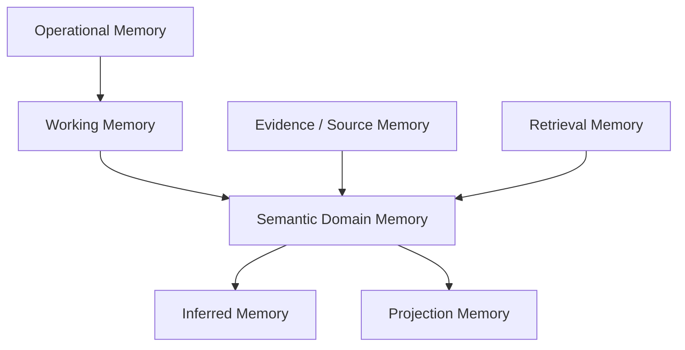

# Memory Layer

## 1. Khái niệm

Memory Layer của hệ thống không phải một vector database và cũng không phải lịch sử chat của LLM.

Memory Layer là tập hợp các cơ chế lưu giữ:

- Tri thức nghiệp vụ.
- Nguồn bằng chứng.
- Trạng thái vận hành.
- Dữ liệu truy xuất.
- Ngữ cảnh làm việc ngắn hạn.
- Kết quả suy luận.
- Lịch sử thay đổi.

Mỗi loại memory có source of truth, vòng đời và cơ chế truy cập khác nhau.

---

## 2. Tổng quan phân lớp



---

## 3. Semantic Domain Memory

### Vai trò

Lưu project knowledge có cấu trúc và authoritative:

- Project.
- Person và Team.
- Requirement.
- Task.
- Decision.
- Question.
- Risk.
- Assumption.
- Constraint.
- Milestone.
- Deliverable.
- Research Finding.
- Document metadata.
- Semantic relations.
- Temporal validity.
- Verification status.

### Storage

- RDF triple store.
- Named asserted graph theo project.

### Ví dụ

```turtle
project:task-17
    a brse:Task ;
    brse:hasStatus brse:InProgress ;
    brse:implements project:req-4 ;
    brse:assignedTo project:person-minh .
```

### Nguyên tắc

- Đây là domain source of truth.
- Không ghi trực tiếp từ LLM.
- Mọi update qua Semantic Core.
- Có SHACL validation.
- Có provenance.
- Không overwrite lịch sử semantic quan trọng.

---

## 4. Candidate Memory

### Vai trò

Lưu tri thức do:

- LLM đề xuất.
- Rule gợi ý.
- Entity linker đề xuất.
- Connector mapping phát hiện.
- Người dùng đang draft nhưng chưa xác nhận.

### Storage

- RDF candidate graph.

### Thuộc tính cần có

- Candidate type.
- Proposed class.
- Proposed predicate.
- Confidence.
- Evidence span.
- Source artifact.
- Model/version.
- Created time.
- Review status.
- Reviewer feedback.

### Lifecycle

```text
PROPOSED
→ VALIDATED
→ CONFIRMED
→ ASSERTED

hoặc

PROPOSED
→ REJECTED
```

Candidate memory không được trộn với asserted knowledge.

---

## 5. Inferred Memory

### Vai trò

Lưu fact được suy ra bằng:

- RDFS/OWL semantics.
- Jena rules.
- Deterministic business rules.

Ví dụ:

```text
Task T1 is Blocked
Task T1 implements Requirement R1
→ Requirement R1 has Delivery Risk
```

### Storage

- RDF inferred graph.

### Yêu cầu

- Ghi rule đã sử dụng.
- Ghi dependency fact.
- Có thể rebuild.
- Không hiển thị như human-confirmed fact.
- Invalidation khi asserted fact thay đổi.

---

## 6. Evidence and Source Memory

### Vai trò

Lưu nguồn nguyên bản để truy vết và reprocess:

- Quick note.
- Raw connector event.
- Message snapshot.
- Email content.
- Document.
- Attachment.
- Research webpage snapshot hoặc citation metadata.
- External task-system payload.

### Storage

- Object storage cho raw/binary content.
- RDF source graph cho metadata và provenance.
- PostgreSQL cho ingestion metadata, hash và idempotency.

### Ví dụ liên kết

```turtle
project:task-17
    prov:wasDerivedFrom project:note-item-12 .

project:note-item-12
    prov:wasDerivedFrom source:quick-note-91 .
```

### Nguyên tắc

- Source artifact không đồng nghĩa fact.
- Raw data phải bất biến hoặc versioned.
- Có content hash.
- Có source system và external identifier.
- Có retention policy.

---

## 7. Retrieval Memory

### Vai trò

Hỗ trợ tìm context liên quan:

- Full-text search.
- Embedding search.
- Hybrid search.
- Alias search.
- Similarity-based candidate linking.
- Document chunk retrieval.

### Storage

- OpenSearch/Elasticsearch hoặc pgvector.
- Có thể kết hợp RDF entity IRI làm key.

### Không authoritative

Retrieval memory chỉ trả candidate context. Similarity không tạo ra semantic relation chính thức.

### Ví dụ pipeline

```text
Mention "login API"
→ vector/full-text retrieve Task T12, T19
→ project/type filter
→ LLM rerank
→ candidate entity link
→ human/rule confirmation
```

---

## 8. Operational Memory

### Vai trò

Lưu trạng thái vận hành phần mềm:

- Workflow run.
- Agent run.
- Connector installation.
- OAuth metadata.
- Webhook subscription.
- Sync cursor.
- Retry.
- Dead-letter.
- Idempotency.
- Rate limit.
- Notification delivery.
- UI preferences.
- Read model refresh state.

### Storage

- PostgreSQL.
- Redis cho cache/lock ngắn hạn nếu cần.
- Secret manager cho token thật.

### Không đưa vào ontology

Các trạng thái như `RETRYING`, `attempt=2`, `cursor=abc` không phải project knowledge.

---

## 9. Working and Session Memory

### Vai trò

Giữ ngữ cảnh ngắn hạn cho một workflow hoặc interaction:

- User intent hiện tại.
- Tool results đã lấy.
- Pending confirmation.
- Draft chưa hoàn thành.
- Current project scope.
- Selected entities.
- Temporary reasoning context.

### Storage

- PostgreSQL hoặc Redis.
- Có TTL.
- Không được coi là long-term truth.
- Chỉ các kết quả đã xác nhận mới được ghi vào semantic memory.

---

## 10. Projection Memory

### Vai trò

Tạo read model tối ưu cho UI và reporting:

- Project dashboard.
- Task list.
- Requirement summary.
- Upcoming deadline.
- Person workload.
- Project health snapshot.

### Storage

- PostgreSQL materialized projection.
- Search index.

### Nguyên tắc

- Có thể rebuild từ RDF.
- Không cho UI update trực tiếp.
- Chỉ là read model.
- Có projection version.

---

## 11. Authority Hierarchy

| Memory type | Authoritative cho điều gì |
|---|---|
| Asserted Semantic Memory | Domain facts |
| Verified external system link | State do external system quản lý |
| Inferred Memory | Derived facts theo rule |
| Evidence Memory | Nội dung nguồn |
| Operational Memory | Runtime state |
| Retrieval Memory | Search candidates |
| Working Memory | Ngữ cảnh tạm |
| Projection Memory | UI/read optimization |

---

## 12. Đồng bộ giữa các memory

### Domain update flow

```text
Candidate confirmed
→ Update asserted RDF
→ Write provenance
→ Run inference
→ Publish domain event
→ Refresh projections
→ Refresh search index
```

### Source ingestion flow

```text
Connector event
→ Operational deduplication
→ Raw source storage
→ Source RDF metadata
→ Candidate extraction
```

### Rebuild capability

Phải có khả năng:

- Rebuild inferred graph từ asserted graph.
- Rebuild projection từ RDF.
- Rebuild vector index từ source và entity text.
- Reprocess source artifact bằng model mới mà không mất assertion cũ.

---

## 13. Memory isolation

Mỗi truy vấn phải có:

- Tenant scope.
- Project scope.
- User permission.
- Knowledge status.
- Time range khi phù hợp.
- Source visibility.

Named graph chỉ là một phần của isolation. Authorization vẫn nằm ở policy layer.

---

## 14. Điều không được làm

- Dùng chat history của LLM làm project memory.
- Dùng vector similarity làm fact.
- Lưu raw connector payload trực tiếp thành requirement.
- Gộp candidate và asserted graph.
- Để projection trở thành source of truth.
- Để agent tự sửa operational state ngoài workflow.
- Xóa requirement cũ khi có requirement mới thay thế.
