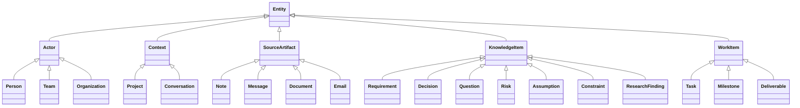
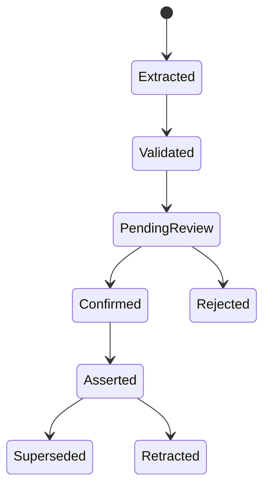

# Ontology Design

## 1. Mục tiêu

Ontology định nghĩa shared meaning của hệ thống:

- Những loại entity nào tồn tại.
- Quan hệ nào hợp lệ.
- Thuộc tính nào cần có.
- Constraint nào phải được đáp ứng.
- Fact nào có thể suy luận.
- Nguồn và trạng thái xác nhận của tri thức.

Ontology không chỉ là sơ đồ class. Nó là contract giữa connector mapping, semantic core, agent tool, UI và data governance.

---

## 2. Phương pháp thiết kế

Sử dụng competency-question-driven ontology engineering.

Ví dụ competency questions:

- Requirement hiện hành của feature X là gì?
- Requirement nào đã bị supersede?
- Task nào triển khai requirement R?
- Question nào đang block task T?
- Decision D dựa trên source nào?
- Những task nào cần impact review sau thay đổi requirement?
- Fact nào do AI đề xuất nhưng chưa được xác nhận?
- Một người xuất hiện trên Teams và Slack có phải cùng Person không?
- Research finding nào hỗ trợ decision?
- Project nào đang có delivery risk và vì sao?

Mỗi class, property hoặc rule phải phục vụ ít nhất một competency question hoặc governance requirement.

---

## 3. Ontology modules

```text
Core Ontology
Project Ontology
Work Ontology
Requirement Ontology
Communication Ontology
Research Ontology
Integration Ontology
Identity Ontology
Provenance Ontology
Temporal Ontology
```

### 3.1. Core Ontology

- Entity.
- KnowledgeItem.
- WorkItem.
- SourceArtifact.
- Actor.
- Context.
- Status.
- VerificationState.

### 3.2. Project Ontology

- Project.
- Milestone.
- Deliverable.
- ProjectRole.
- ProjectMembership.

### 3.3. Work Ontology

- Task.
- ProgressClaim.
- Dependency.
- Blocker.
- Assignment.
- WorkStatus.

### 3.4. Requirement Ontology

- Requirement.
- FunctionalRequirement.
- NonFunctionalRequirement.
- Constraint.
- Assumption.
- Decision.
- Question.
- Risk.

### 3.5. Communication Ontology

- Message.
- Conversation.
- Thread.
- Note.
- NoteItem.
- Attachment.
- CommunicationChannel.

### 3.6. Research Ontology

- ResearchQuestion.
- ResearchActivity.
- ResearchFinding.
- SourceReference.
- Option.
- EvaluationCriterion.
- Recommendation.

### 3.7. Integration Ontology

- Connector.
- ConnectorType.
- ExternalResource.
- ExternalIdentity.
- SourceSystem.
- Capability.

### 3.8. Provenance

Tái sử dụng PROV-O:

- `prov:Entity`.
- `prov:Activity`.
- `prov:Agent`.
- `prov:wasDerivedFrom`.
- `prov:wasGeneratedBy`.
- `prov:wasAttributedTo`.
- `prov:used`.

---

## 4. Class hierarchy sơ bộ



---

## 5. Object properties chính

### Context

```text
BELONGS_TO_PROJECT
PART_OF
HAS_MEMBER
HAS_ROLE
```

### Provenance

```text
DERIVED_FROM
SUPPORTED_BY
CONTRADICTED_BY
MENTIONED_IN
GENERATED_BY
CONFIRMED_BY
```

### Requirement evolution

```text
REFINES
CLARIFIES
SUPERSEDES
CONFLICTS_WITH
CONSTRAINED_BY
ACCEPTED_BY
```

### Execution

```text
IMPLEMENTS
VALIDATES
ADDRESSES
DEPENDS_ON
BLOCKS
BLOCKED_BY
ASSIGNED_TO
OWNED_BY
PRODUCES
```

### Reasoning and research

```text
ANSWERS
RESOLVES
JUSTIFIES
RECOMMENDS
EVALUATES
IDENTIFIES
```

### Integration

```text
ORIGINATED_FROM
HAS_EXTERNAL_IDENTITY
REPRESENTS_EXTERNAL_RESOURCE
SUPPORTS_CAPABILITY
```

---

## 6. Property semantics

Ví dụ OWL:

```turtle
brse:Task a owl:Class ;
    rdfs:subClassOf brse:WorkItem .

brse:Requirement a owl:Class ;
    rdfs:subClassOf brse:KnowledgeItem .

brse:implements a owl:ObjectProperty ;
    rdfs:domain brse:Task ;
    rdfs:range brse:Requirement ;
    owl:inverseOf brse:implementedBy .
```

Chỉ dùng OWL constructs có giá trị runtime rõ ràng. Full OWL 2 DL có thể được dùng để kiểm tra ontology offline, nhưng runtime ưu tiên RDFS/OWL subset thực dụng và deterministic rules.

---

## 7. SHACL shapes

SHACL dùng cho closed-world validation.

### Task shape

```turtle
brse:TaskShape
    a sh:NodeShape ;
    sh:targetClass brse:Task ;

    sh:property [
        sh:path brse:belongsToProject ;
        sh:class brse:Project ;
        sh:minCount 1 ;
        sh:maxCount 1
    ] ;

    sh:property [
        sh:path brse:title ;
        sh:datatype xsd:string ;
        sh:minCount 1
    ] .
```

### Candidate evidence shape

Candidate do AI tạo phải có:

- Source artifact.
- Evidence span hoặc source fragment.
- Model identifier.
- Confidence.
- Candidate status.
- Proposed ontology version.

### Cross-project constraint

Quan hệ `IMPLEMENTS`, `BLOCKS`, `SUPPORTS` mặc định chỉ hợp lệ khi source và target thuộc cùng project, trừ relation type được khai báo cross-project.

### Status constraint

Task chuyển sang `Done` cần:

- Confirmation activity, hoặc
- Verified external state từ task system có thẩm quyền.

---

## 8. Named graph model

```text
/ontology/core
/ontology/shapes
/ontology/rules
/ontology/version/{version}

/project/{id}/sources
/project/{id}/candidates
/project/{id}/asserted
/project/{id}/inferred
/project/{id}/provenance
```

### Sources graph

Metadata của source artifact.

### Candidates graph

AI/rule suggestions chưa được xác nhận.

### Asserted graph

Fact do người hoặc external authoritative system xác nhận.

### Inferred graph

Fact do reasoner sinh.

### Provenance graph

Activity, agent, source, model và confirmation history.

---

## 9. Semantic lifecycle



Mỗi transition có provenance và actor.

---

## 10. Inference rules

### Delivery risk

```text
Task implements Requirement
AND Task has status Blocked
→ Requirement has delivery risk
```

### Impact review

```text
New Requirement supersedes Old Requirement
AND Task implements Old Requirement
→ Task requires impact review
```

### Unresolved dependency

```text
Question blocks Task
AND Question status Open
→ Task has unresolved blocker
```

### Research support

```text
Research Finding answers Question
AND Decision resolves Question
→ Decision is supported by Research Finding
```

Rule phải:

- Có identifier.
- Có version.
- Có test.
- Ghi derivation.
- Chỉ materialize vào inferred graph.

---

## 11. Temporal model

Không overwrite lịch sử.

Các relation quan trọng có:

- `validFrom`.
- `validTo`.
- `recordedAt`.
- `supersededBy`.
- `effectiveStatus`.

Ví dụ:

```text
R2 SUPERSEDES R1
R1 validTo 2026-08-01
R2 validFrom 2026-08-01
```

Có thể dùng named assertion node hoặc RDF-star/reification khi cần metadata trên edge. Lựa chọn phải được benchmark trong Jena trước khi chốt.

---

## 12. Identity resolution

Một `Person` có thể có nhiều `ExternalIdentity`.

```text
Person Minh
├── Teams identity
├── Slack identity
├── Email identity
└── Jira identity
```

Không merge tự động chỉ dựa trên tên.

Entity resolution flow:

```text
External identity
→ deterministic match
→ project context
→ candidate person links
→ human confirmation nếu ambiguity
```

---

## 13. Ontology storage and tooling

### Source of ontology

Git repository:

```text
ontology/
├── core.ttl
├── project.ttl
├── work.ttl
├── requirement.ttl
├── communication.ttl
├── integration.ttl
├── shapes/
├── rules/
├── examples/
├── competency-questions/
└── migrations/
```

### Runtime

- Apache Jena.
- Fuseki.
- TDB2.
- Jena SHACL.
- Jena Generic Rule Reasoner.

### Editing

- Protégé.
- Text editor với Turtle support.
- SPARQL query tests.

---

## 14. Versioning and migration

Mỗi ontology release có:

- Version IRI.
- Changelog.
- Backward compatibility note.
- SHACL version.
- Rule version.
- Migration script.
- Test dataset.
- Competency query test.

Không cho LLM tự thay production ontology.

---

## 15. Testing

### Unit tests

- Class/property constraints.
- SHACL conformance.
- Rule output.
- Invalid cross-project relation.
- Candidate evidence requirements.

### Competency tests

Mỗi competency question có SPARQL query và expected result.

### Regression tests

- Ontology upgrade.
- Inference rebuild.
- Candidate promotion.
- Supersede/retract behavior.
- Provenance completeness.

### Data quality tests

- Orphan entity.
- Missing project.
- Missing provenance.
- Duplicate external identity.
- Candidate accidentally placed in asserted graph.

---

## 16. Ontology governance

Các thay đổi ontology phải qua:

1. Use-case justification.
2. Competency question.
3. Design review.
4. SHACL update.
5. Rule impact analysis.
6. Migration plan.
7. Regression test.
8. Version release.

Ontology là source code của domain meaning, không phải metadata tự do.

---

## 17. Incremental AI-Assisted Evolution

Ontology được phát triển tăng dần theo competency question, use case và governance requirement. Không giả định mô hình ban đầu sẽ đầy đủ hoặc luôn đúng.

Agent có thể:

- Khám phá domain concept và đề xuất semantic model.
- Tạo hoặc sửa ontology module, class, object property, datatype property và controlled individual.
- Tạo SHACL shape, inference rule, example graph và competency test liên quan.
- Phân tích compatibility, migration, deprecation và impact.
- Sửa proposal theo human review.

Mọi artifact do agent tạo mặc định có trạng thái `PENDING_HUMAN_REVIEW`. Agent không được:

- Tự ghi nhận human approval.
- Tự phát hành ontology version.
- Tự migrate shared/production dataset.
- Tự cập nhật runtime ontology hoặc asserted graph.
- Tự giải quyết một architecture decision chưa được chốt mà không nêu rõ lựa chọn.

Human reviewer chịu trách nhiệm cuối cùng cho:

1. Semantic meaning.
2. Vocabulary name và stable IRI.
3. Validation behavior.
4. Inference behavior.
5. Migration/deprecation plan.
6. Authorization triển khai hoặc phát hành.

Workflow chuẩn cho agent được đóng gói trong skill `projecta-evolve-ontology`. Skill phải đọc tài liệu initialization hiện hành thay vì sao chép chúng thành một nguồn chuẩn thứ hai.
